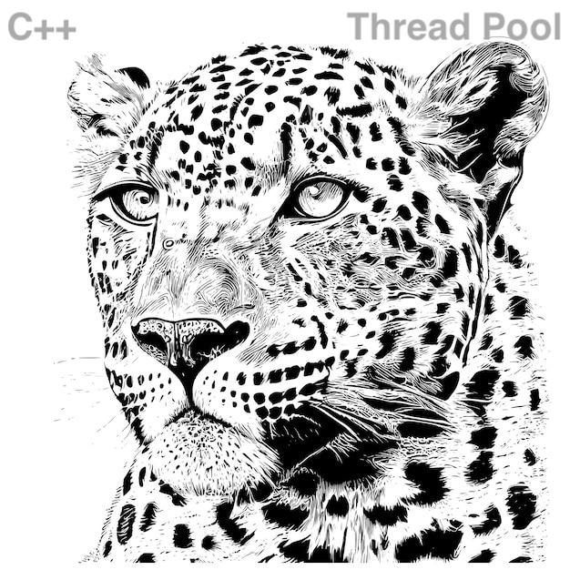

<!--
Copyright (c) 2023-2028, Hossein Moein
All rights reserved.

Redistribution and use in source and binary forms, with or without
modification, are permitted provided that the following conditions are met:
* Redistributions of source code must retain the above copyright
notice, this list of conditions and the following disclaimer.
* Redistributions in binary form must reproduce the above copyright
notice, this list of conditions and the following disclaimer in the
documentation and/or other materials provided with the distribution.
* Neither the name of Hossein Moein and/or the ThreadPool nor the
names of its contributors may be used to endorse or promote products
derived from this software without specific prior written permission.

THIS SOFTWARE IS PROVIDED BY THE COPYRIGHT HOLDERS AND CONTRIBUTORS "AS IS" AND
ANY EXPRESS OR IMPLIED WARRANTIES, INCLUDING, BUT NOT LIMITED TO, THE IMPLIED
WARRANTIES OF MERCHANTABILITY AND FITNESS FOR A PARTICULAR PURPOSE ARE
DISCLAIMED. IN NO EVENT SHALL Hossein Moein BE LIABLE FOR ANY
DIRECT, INDIRECT, INCIDENTAL, SPECIAL, EXEMPLARY, OR CONSEQUENTIAL DAMAGES
(INCLUDING, BUT NOT LIMITED TO, PROCUREMENT OF SUBSTITUTE GOODS OR SERVICES;
LOSS OF USE, DATA, OR PROFITS; OR BUSINESS INTERRUPTION) HOWEVER CAUSED AND
ON ANY THEORY OF LIABILITY, WHETHER IN CONTRACT, STRICT LIABILITY, OR TORT
(INCLUDING NEGLIGENCE OR OTHERWISE) ARISING IN ANY WAY OUT OF THE USE OF THIS
SOFTWARE, EVEN IF ADVISED OF THE POSSIBILITY OF SUCH DAMAGE.
-->


This is a light-weight C++ Thread Pool that allows object member functions to run on threads. 

```cpp
struct   MyClass  {
    bool routine ()  {
        struct timespec rqt;

        rqt.tv_sec = 1;
        rqt.tv_nsec = 0;
        ::nanosleep (&rqt, nullptr);

        std::cout << "From routine()\n";

        return (true);
    }
private:
    int data { }
};

// -------------------------------------------------------------

using ThreadPoolType = ThreadPool<MyClass>;

static const size_t THREAD_COUNT = 5;
MyClass             my_obj;

// -------------------------------------------------------------

int main (int, char *[])  {

    ThreadPoolType  thr_pool (THREAD_COUNT, true, 12);

    thr_pool.add_thread (2);
    thr_pool.add_thread (-3);
    thr_pool.dispatch (&my_obj, &MyClass::routine);

    return (EXIT_SUCCESS);
}
```
